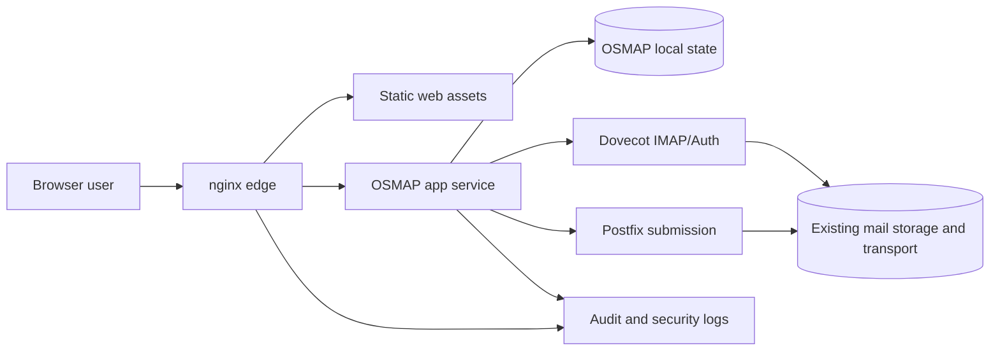

# Architecture Overview

## Status

This document is the Phase 4 architecture baseline for OSMAP. It uses:

- the Phase 2 product definition as the scope boundary
- the Phase 3 security model as the control boundary
- the OpenBSD-native SDLC and hosting guidance as the implementation posture

This is the blueprint for implementation planning, not a guarantee that every
low-level interface is frozen forever.

## Architectural Objective

Build a small, defensible browser-mail system that replaces Roundcube's core
role while preserving the existing OpenBSD mail stack.

The architecture should:

- minimize new moving parts
- avoid turning the web layer into a second mail platform
- preserve compatibility with current IMAP and submission services
- be operable by a small team
- remain plausible for future OpenBSD-oriented packaging and maintenance

## Selected High-Level Architecture

Version 1 should use a small three-layer model:

1. Edge layer
   nginx remains the public or VPN-gated HTTP entry point
2. OSMAP application layer
   a small application service handles browser auth, session policy, mailbox
   operations orchestration, rendering/API responses, and audit generation
3. Existing mail substrate
   Dovecot, Postfix submission, and the surrounding mail stack remain the
   authority for mailbox and message transport behavior

This intentionally avoids:

- direct browser access to IMAP or SMTP
- plugin ecosystems
- a broad microservice architecture
- replacing the current mail stack in Version 1

## Component Diagram

## Component Specifications

### Edge Layer

Responsibilities:

- TLS termination
- request routing
- path restriction
- header normalization
- staged exposure control aligned with PF and current deployment policy
- static asset serving where practical

Non-responsibilities:

- mailbox business logic
- session authority
- user-specific authorization decisions beyond coarse routing restrictions

### OSMAP Application Service

Responsibilities:

- browser login flow
- MFA enforcement for the browser product
- session lifecycle and revocation
- mailbox and message operation orchestration
- request validation and authorization
- audit event generation
- safe rendering policy for HTML mail and attachments

Non-responsibilities:

- owning the canonical mail store
- replacing SMTP or IMAP services
- becoming a general admin platform

### Local OSMAP State

Version 1 should keep application-specific state intentionally small.

It should store only what the application truly needs, such as:

- MFA enrollment state
- session state or revocation state
- security event metadata
- minimal user preferences required for Version 1

Preferred design direction:

- use a local embedded store for OSMAP-specific state where practical to avoid
  introducing a new database dependency just for the web layer

If later evidence shows a separate embedded store is not suitable, that decision
should be explicitly revisited rather than silently expanding dependency scope.

### Existing Mail Backends

Responsibilities retained by the current stack:

- IMAP mailbox access and auth-adjacent behavior in Dovecot
- SMTP submission and outbound message flow in Postfix
- existing anti-abuse and filtering paths in the broader mail environment

## Service Boundaries

The architecture should enforce these boundaries:

- nginx only forwards approved application traffic
- the app service has only the backend connectivity it actually requires
- local state is separated from static assets and edge config
- session and auth logic stay inside the application service, not in scattered
  frontend code
- mail storage and transport remain in the existing substrate

Version 1 should prefer one small application service over a distributed set of
loosely bounded internal services. More processes are only justified when they
meaningfully improve isolation.

## Interface Definitions

At Phase 4, the required interfaces are defined conceptually rather than as
final code contracts.

### Browser To Edge

- HTTPS only
- static asset requests
- authenticated application requests
- no direct browser access to IMAP, SMTP, or application-local state

### Edge To Application

- local HTTP or Unix-socket-backed proxying
- only the routes required for Version 1
- no broad pass-through to unrelated local services

### Application To Mail Backends

- a bounded IMAP-facing integration path for mailbox operations
- a bounded submission-facing integration path for sending mail
- no assumption that the browser app becomes the new canonical mail authority

### Application To Local State

- session and security state reads and writes
- minimal preference state where justified
- no uncontrolled blob of app-owned data

## Data Flow

### Login Flow

1. User connects to the edge over HTTPS.
2. Edge forwards the login flow to the OSMAP application service.
3. Application verifies mailbox credentials against the approved backend path.
4. Application enforces browser MFA policy.
5. Application establishes a bounded browser session.
6. Application records security-relevant audit events.

### Mail Read Flow

1. User requests mailbox or message data.
2. Application verifies session and authorization.
3. Application retrieves required data from IMAP-facing backend interaction.
4. Application transforms the response into the safe browser-facing format.
5. Sensitive or notable actions are audited as needed.

### Send Flow

1. User composes and submits a message.
2. Application validates session, authorization, and request shape.
3. Application hands off send behavior to the existing submission path.
4. Application records the action in audit-relevant form.

## Integration With Mail Stack

Version 1 should integrate with the existing stack as a consumer, not a
replacement.

Integration principles:

- IMAP remains the authoritative mailbox access protocol
- submission remains the authoritative outbound mail path
- the application should not invent a parallel transport stack
- the application should preserve coexistence with native clients

This means the app is effectively a controlled translation and policy layer
between the browser and the existing mail services.

## Deployment Topology

The preferred deployment topology is:

- nginx on the host edge
- OSMAP application service behind nginx on loopback or a local socket
- existing mail services remaining locally reachable through tightly scoped
  paths
- initial deployment compatible with the current VPN-first model

This keeps Version 1 simple enough to understand operationally while leaving
room for stricter separation later if justified.

## Reverse Proxy Strategy

The edge should:

- serve static assets directly when practical
- forward only the OSMAP application paths required for Version 1
- keep unrelated control-plane paths out of OSMAP
- preserve the option to keep OSMAP VPN-restricted at first

The reverse proxy should not absorb application semantics that properly belong
in the app service.

## External Dependencies

The architecture should keep new dependencies to the minimum needed for:

- application runtime
- minimal frontend asset build
- safe mail and session handling

Explicit dependency posture:

- no server-side JavaScript runtime as the primary trust anchor
- no plugin or extension system
- no heavyweight distributed infrastructure introduced just for webmail
- no new always-on external services unless clearly justified

## Technology Rationale

### Frontend

The frontend should be a thin web UI that compiles to static assets.

Rationale:

- keeps runtime simple
- avoids a separate dynamic frontend server tier
- reduces the number of privileged moving parts
- makes nginx-based asset serving straightforward

### Backend

The backend should be a small, security-focused service with a narrow interface.

Preferred properties:

- memory-safe implementation if it does not undermine OpenBSD portability goals
- easy to confine with `pledge(2)` and `unveil(2)` where practical
- dependency-minimal
- suitable for packaging and long-term maintenance

#### Language Decision

Rust remains attractive for security-sensitive backend work because of memory
safety and strong tooling around correctness. However, broad OpenBSD
availability and future ports credibility mean the toolchain burden and
architecture coverage cannot be ignored.

Architecture decision:

- do not hard-wire the project to a backend toolchain that makes OpenBSD
  deployment or packaging unrealistic
- prefer a backend implementation strategy that can meet both security and
  OpenBSD maintenance goals
- treat Rust as a strong candidate, not an unquestionable default

This is an intentional constraint, not indecision.

## OpenBSD-Specific Design Expectations

The architecture should aim to:

- use OpenBSD-native process and filesystem confinement where feasible
- avoid Linux-first assumptions
- fit rc-style service management and simple host operations
- remain comprehensible to OpenBSD operators
- avoid dependency chains that would make ports maintenance painful

## Risks

Primary architectural risks include:

- choosing a backend toolchain that weakens OpenBSD portability
- allowing the app service to become a broad protocol or admin platform
- overcomplicating local state management
- designing browser MFA in a way that conflicts with broader mail access
- pushing too much trust into the reverse proxy instead of the application

## Deferred Questions

These questions are intentionally left for later phases:

- the exact storage format and schema for local OSMAP state
- the final backend language choice after portability and packaging review
- the exact interface shape for IMAP and submission integration code
- whether later phases justify splitting the app service into more than one
  process
