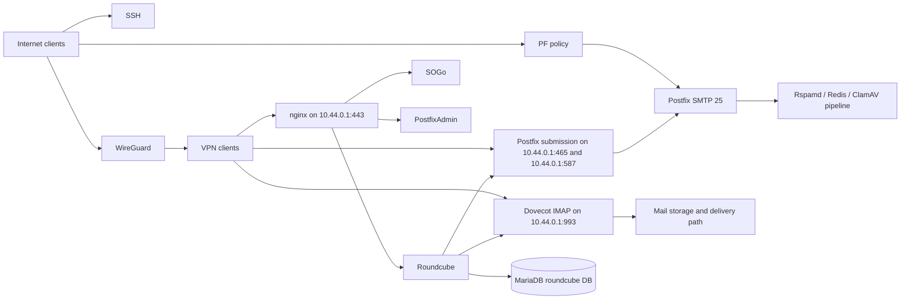

# Current System Architecture

## Scope

This document is the public-safe Phase 1 snapshot of the existing platform that
OSMAP will have to integrate with and eventually sit in front of or replace at
the browser access layer.

## Observation Date

Read-only host inspection was performed on March 27, 2026 against
`mail.blackbagsecurity.com`.

## Host Baseline

- Hostname: `mail.blackbagsecurity.com`
- Operating system: OpenBSD 7.7 `GENERIC.MP`
- Current uptime during inspection: just over five days
- Current model: single host running both mail services and multiple web/control
  plane applications

## Active Service Set

Observed enabled services include:

- Postfix
- Dovecot
- nginx
- PHP 8.3 FPM
- MariaDB
- Redis
- Rspamd
- ClamAV
- SOGo
- PF and pflogd
- WireGuard
- Suricata
- sshguard
- unbound

This confirms that the current deployment is not just "Roundcube on a box." It
is a layered mail and control-plane host with multiple interdependent
applications.

## Current Architecture Summary

## Service Bindings Observed

The live host shows:

- SMTP on port 25 listening broadly
- SSH listening on the host LAN-facing address
- IMAP on port 993 bound to localhost and the WireGuard address
- submission ports 465 and 587 bound to localhost and the WireGuard address
- HTTPS on port 443 bound to localhost and the WireGuard address
- ancillary control and monitoring ports on localhost or the WireGuard address

This strongly supports the design assumption that the user-facing mail and web
services are intentionally restricted to trusted paths rather than the public
internet.

## Web Layer Layout

The nginx configuration indicates:

- a chrooted web root under `/var/www`
- a plaintext port 80 vhost for ACME and redirect behavior
- an SSL vhost bound to `127.0.0.1:443` and `10.44.0.1:443`
- a single main SSL vhost serving multiple applications through included
  templates

Observed applications routed through nginx templates include:

- Roundcube at the host root
- SOGo under `/sogo/` and related paths
- PostfixAdmin
- Rspamd
- operational monitoring and PF dashboards

## Mail Layer Layout

Evidence indicates the current mail path is split as follows:

- Postfix handles inbound SMTP and client submission
- Dovecot handles IMAP and LMTP-related roles and provides TLS-protected mail
  access on localhost and the WireGuard address
- Roundcube is a consumer of those services, not the authority for mail state
- MariaDB stores application state for Roundcube and likely other local control
  plane applications

## Control-Plane Access Model

The nginx control-plane allowlist currently contains:

- localhost
- the WireGuard client subnet

That aligns with the PF policy observed on the host: user-facing web and mail
access paths are intentionally VPN-only, while WAN exposure is kept narrow.

## Preliminary Trust Boundaries

The current deployment has at least these boundaries:

- public internet to PF-enforced WAN listeners
- WireGuard clients to VPN-only web and mail surfaces
- nginx and PHP-FPM to application code in the web chroot
- Roundcube to IMAP, SMTP submission, and MariaDB
- mail services to local persistence and filtering services
- operator access to the host via SSH and local privilege escalation

## Architectural Implication For OSMAP

OSMAP cannot be designed as if it were the only application on the host. It has
to respect an existing mail platform, an existing operational security posture,
and a current preference for sharply constrained exposure.
