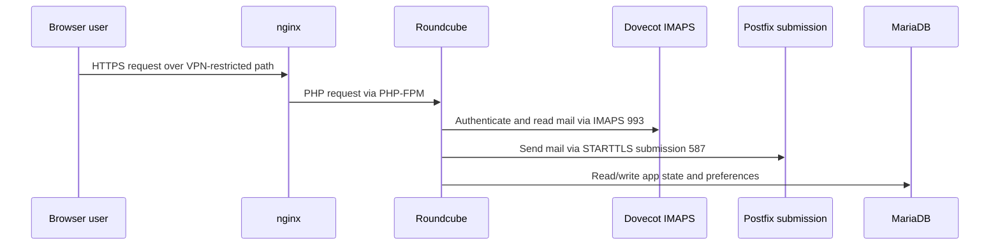

# Roundcube Dependency Analysis

## Current Role

Roundcube is the current browser-based mail interface for mailbox users. It is
not the center of the platform, but it is the current webmail consumer of the
mail stack.

## Confirmed Dependencies

From repository notes and live inspection, Roundcube currently depends on:

- nginx for request routing and TLS termination at the web edge
- PHP-FPM for application execution
- Dovecot over IMAPS on port 993
- Postfix submission over STARTTLS on port 587
- MariaDB for application state
- host-local secret includes for database and encryption material
- local filesystem paths for logs and temp data under `/var/www/roundcubemail`

## Current Access Path

## Roundcube-Specific State

Roundcube carries application-specific state that a replacement must account
for:

- user preferences
- session behavior
- plugin behavior and related configuration
- application database schema and data
- filesystem-based temp and log paths

The presence of local secret overlays also means configuration management and
secret handling are part of the migration problem.

## Observed Configuration Shape

Public-safe observations from the active config:

- IMAP host points to `mail.blackbagsecurity.com:993` using implicit TLS
- SMTP host points to `mail.blackbagsecurity.com:587` using STARTTLS
- branding has been customized for the current environment
- plugins include `archive` and `managesieve`
- local secret files override placeholder values for the database DSN and
  session encryption key

## Migration Sensitivities

The replacement must identify what users actually rely on today, including:

- mailbox login behavior
- message listing, reading, composing, replying, and forwarding
- folder and archive behavior
- server-side filtering or sieve-related workflows
- attachment upload and download behavior
- session and logout behavior

## Risks Of Assuming Simple Replacement

Treating Roundcube as "just a UI" would be an error because:

- it currently encodes assumptions about auth flow
- it depends on specific mail transport endpoints
- it has database-backed application state
- it may be relied on for ManageSieve-related workflows
- operators already have web routing and support processes built around it

## Replacement Principle

OSMAP should replace Roundcube's user-facing role while disturbing as little of
the proven mail transport and mailbox access model as possible.
