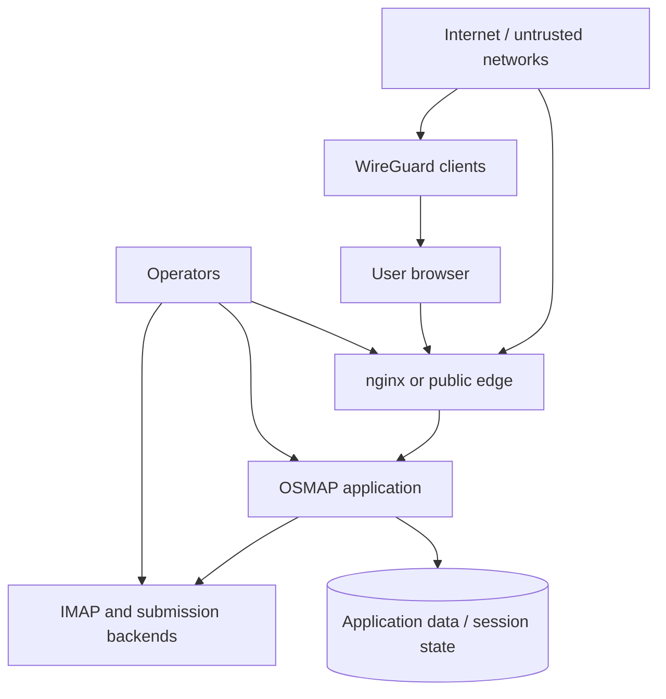

# Security Model

## Status

This document is the Phase 3 security and trust-model baseline for OSMAP.

It began as a pre-implementation control document, but it now also serves as a
constraint set for the implemented browser, auth, session, helper, and
confinement slices. It defines:

- the attacker model
- the trust boundaries
- the expected protection goals
- the abuse cases that later architecture and implementation work must address

## Security Posture

OSMAP is intended for environments where browser-based mail access is necessary
but high-risk. Security is therefore a primary design driver, not a late-stage
hardening exercise.

## Primary Objectives

- Reduce attack surface relative to the current Roundcube-based path
- Limit privilege and blast radius of every new component
- Protect credentials, sessions, and message access
- Keep trust boundaries explicit and reviewable
- Preserve visibility for operations, detection, and recovery

## Threat Model

OSMAP should be designed against the following threat categories:

- credential theft and reuse
- phishing-assisted account takeover
- session theft, fixation, replay, or abuse
- broken access control between users or sessions
- abuse of outbound message submission for spam or fraud
- content exfiltration through compromised sessions or application defects
- malicious input through message content, MIME structures, attachments, or user
  parameters
- operator mistakes that unintentionally weaken controls
- compromise attempts against the web runtime, reverse proxy, or adjacent local
  services

The project should assume the web layer will be probed continuously once
internet-exposed and that successful compromise of a mail account has outsized
impact beyond the mail system itself.

## Adversary Assumptions

The security model assumes realistic adversaries may have one or more of the
following capabilities:

- access to stolen passwords
- phishing infrastructure or phishing proxies
- malware or browser compromise on a user endpoint
- access to a VPN credential or a foothold inside a previously trusted network
- automated tooling for credential stuffing, session probing, and spam abuse
- ability to deliver hostile email content or attachments to a target mailbox
- knowledge of common web application weakness classes such as injection, broken
  access control, unsafe file handling, and session flaws

The model does not assume that network location implies trust.

## Current-State Observations

The current environment already demonstrates several security-positive patterns:

- VPN-first access for user-facing web and mail ports
- PF default deny posture
- explicit nginx control-plane allowlisting
- localhost and VPN-only bindings for sensitive services
- layered support services such as sshguard, Suricata, Rspamd, Redis, and
  ClamAV

These are strengths that the replacement should preserve or improve, not bypass.

## Trust Boundaries

Current and future work should treat these boundaries as first-class.

Key trust boundaries include:

- public internet to the WAN edge
- WireGuard clients to VPN-only service surfaces
- browser to nginx
- nginx and runtime services to application code
- application code to IMAP, submission, and persistence layers
- operator SSH and `doas` access to the host
- application-controlled session state to user-controlled browsers
- user-triggered content rendering to browser execution context

## Abuse Scenarios

The project must explicitly account for at least the following abuse scenarios:

### Credential Attack

An attacker attempts password spraying, credential stuffing, or replay of
previously stolen mailbox credentials against the browser login flow.

Required defensive implications:

- strong MFA
- rate limiting and anomaly visibility
- useful auth logging
- careful failure behavior that does not leak unnecessary detail

The current implementation now includes a bounded application-layer
login-throttling model on top of the browser auth path. It applies both:

- a tighter credential-plus-remote bucket
- a higher-threshold remote-only bucket

That makes repeated username rotation from one source materially more
expensive, but it does not eliminate the need for adjacent controls or broader
anomaly detection.

### Account Takeover After Credential Theft

An attacker successfully authenticates with stolen credentials and attempts to
persist via session reuse, message exfiltration, or address-book and mailbox
enumeration.

Required defensive implications:

- session visibility and revocation
- suspicious session detection
- bounded session lifetime
- high-value action auditing

### Submission Abuse

An attacker uses a compromised account or automation to send spam, phishing, or
malicious attachments through the existing submission path.

Required defensive implications:

- submission-aware audit trails
- abuse monitoring and alerting
- coordination with existing mail-side anti-abuse controls

The current implementation now includes a bounded application-layer
submission-throttling model on the browser send path. It applies both:

- a tighter canonical-user-plus-remote bucket
- a higher-threshold remote-only bucket

That makes rapid outbound abuse through one source materially harder, but it
still does not replace adjacent mail-side anti-abuse controls, PF, nginx, or
operator monitoring.

### Content-Driven Browser Attack

An attacker delivers hostile message content or attachments designed to exploit
HTML rendering, MIME handling, file previews, or compose/reply workflows.

Required defensive implications:

- conservative HTML rendering
- attachment handling rules
- strict output encoding and parser hygiene
- avoidance of unnecessary client-side complexity

### Backend Or Lateral Access Abuse

An attacker exploits the web app to pivot toward IMAP, submission, database, or
operator-adjacent services on the same host.

Required defensive implications:

- least-privilege backend access
- minimized local trust
- clear service boundaries
- operational visibility into unusual backend use

## Data Sensitivity Classification

OSMAP handles or mediates access to:

- mailbox credentials
- MFA material or MFA-related state
- session tokens or equivalent session state
- message metadata
- message bodies and attachments
- audit and security event records

Credentials, MFA artifacts, and live session state should be treated as highly
sensitive. Mail content is also sensitive, but the system is not attempting a
zero-access privacy model in version 1.

## Privacy Expectations

Version 1 privacy expectations are intentionally limited and explicit:

- no hidden telemetry
- no unnecessary third-party data exposure
- no false claim that the server cannot access user mail
- no Proton-style zero-access guarantees

Privacy in version 1 comes primarily from operator control, limited data
sharing, and disciplined system design rather than end-to-end cryptographic
separation from the operator.

## Security Principles

- Least privilege by default
- Minimal exposed functionality
- Defense in depth
- Identity and session controls treated as core design elements
- Strong separation of public docs from secrets and private notes
- Observability sufficient for incident response and operator confidence

## Security Controls

Later architecture and implementation phases should satisfy these control
expectations:

### Authentication Requirements

- MFA required for browser access, initially TOTP
- strong credential handling and transport security
- application-layer login throttling or equivalent anti-automation friction
  that does not rely on a single credential-keyed bucket alone
- no assumption that VPN location alone is sufficient trust
- compatibility-conscious design for existing native-client realities

### Session Protections

- bounded session lifetime
- rotation or invalidation on sensitive auth transitions
- session revocation capability
- visibility into active or recent sessions
- defenses against fixation, replay, and CSRF-style abuse

### Access Control Expectations

- explicit authorization boundaries between users
- no mixed user/admin privilege surface in the same broad interface
- least-privilege connectivity from app components to backends
- leverage OpenBSD-native containment primitives such as `pledge(2)` and
  `unveil(2)` where the selected architecture and runtime make them practical

### Data Protection Expectations

- protect credentials, MFA secrets, and session state carefully
- minimize storage of sensitive transient data
- avoid over-collecting user-visible telemetry or persistent metadata

### Logging Requirements

- log authentication successes and failures at useful security granularity
- record sensitive actions and session-related security events
- produce logs that support investigation of account takeover and submission
  abuse
- preserve enough context for operators to distinguish user error from likely
  malicious activity

## Residual Risks

Even with the above controls, residual risks remain:

- browser-based mail access remains a high-value target
- TOTP is stronger than password-only auth but not phishing-proof
- shared-host deployment increases the importance of local service isolation
- native-client compatibility may constrain idealized identity choices
- safe public exposure depends on monitoring and operational maturity, not just
  application controls

## Security Assumptions For Later Phases

- Version 1 is mail-only and intentionally narrow
- The current IMAP and submission model remains authoritative
- Native clients continue to exist alongside the browser product
- VPN-first deployment remains a valid early exposure posture
- Network segmentation helps, but identity and session controls must become a
  larger part of the trust model over time
- OpenBSD-specific hardening features should be treated as an advantage to
  exploit where feasible, not as optional decoration
